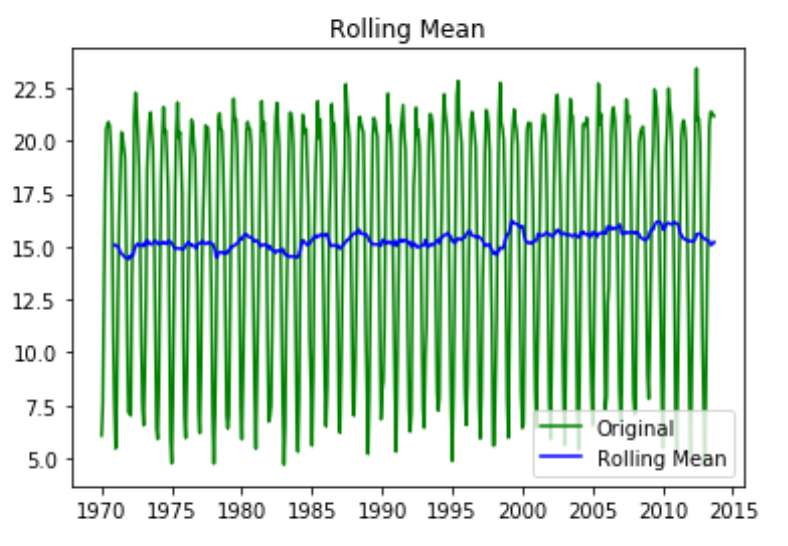
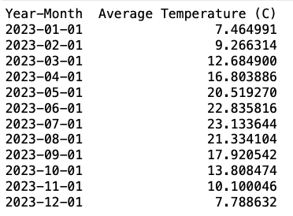

## Time Series Analysis for Temperature Forecasting using ARIMA Model.
This module helps understanding the statistical modeling for time series data anlaysis and forecasting.

### Required modules
- pandas
- numpy
- statsmodel
- matplotlib

### Dataset
In this analysis, a popular dataset from Kaggle is used. You can find it [here](https://www.kaggle.com/berkeleyearth/climate-change-earth-surface-temperature-data). The dataset consists of average monthly temperature recorded from the year 1943 to 2013 for 243 countries. For the current analysis, the temperature data for "Nepal" is used.

### Pre-Processing
- Pandas functionality (i.e., read_csv()) is used to read the data from the csv file. For the current analysis, the temperature data from only after year 1970 is considered. 
- Unwanted columns were also removed.
- Missing values are identified and  filled with their previously recorded data. 

### Stationarity
*Rolling Mean* and *Dickey-Fuller Test* are used to check the stationarity of the time series data. If the time series data does not show stationarity, it is needed to make it stationary for future time series analysis.

**Augmented Dickey-Fuller test:**

*Test Statistic: *-4.137800

***p-value:***                     0.000838

*#Lags Used:*                      15.000000

*Number of Observations Used:*    509.000000

*Critical Value (1%):*             -3.443263

*Critical Value (5%):*             -2.867235

*Critical Value (10%):*            -2.569803

### Statistical Model Building and Forecasting

#### Model Building
**Auto-Regressive Integrated Moving Averages (ARIMA)** model is used for forecasting the average temperature. 

As observed earlier, the time series data is stationary, so only *Auto-Regressive (AR)* and *Moving Averages (MA)* are considered.

To find the number of AR terms, i.e., 'p' and the number of MA terms, i.e. 'q', *Akaike Information Critera (AIC)* is used. The *p* and *q* values are chosen with lowest AIC.

#### Forecasting
Using the model built earlier, it forecasts the average monthly temperature. A sample predictions for the year of 2023 is presented as below.

